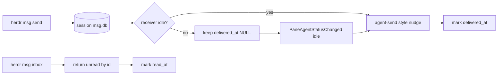

# herdr msg mailbox phase 1 レビュー

## 元の依頼

Claude pane `p_239` から、`docs/next/PLAN-phase1-msg-mailbox.md` に従って `herdr msg` を実装する依頼を受けました。対象は SQLite mailbox と idle-gated push 配送です。

作業ルールは、git worktree内だけで作業すること、承認までcommit/pushしないこと、fail closedにすること、長時間コマンドをHerdr通知経由で実行すること、節目を `p_239` に報告すること、完了前にyunomiで承認を受けることでした。

## 差し戻し対応

| 指摘 | 対応 | 検証 |
| --- | --- | --- |
| 「受け入れ条件§5の自動テスト7系統のうち4系統が未実装」 | `src/app/msg.rs` と `src/server/headless.rs` に、broadcast、fail closed、idle/busy配送、idle遷移flush、再起動flush walkの自動テストを追加しました。 | `cargo test` pass |
| 「REPORT.mdに『既知の挙動』として追記して: agent renameで一意名を付けていないpaneはfrom/to表示がpane id（p_1等）になる」 | 既知の挙動として、mailbox identityが `name > pane id` を使うため、未命名paneでは表示がpane idになることを追記しました。 | REPORT.md更新 |
| 「日本語で書いてね。」 | REPORT.md全体を日本語へ書き直しました。 | yunomi再提出 |

## Why

変更前のHerdrには `herdr agent send` による直接注入はありましたが、耐久的なmailboxはありませんでした。受信側がworking中のときに直接注入すると、作業中コンテキストを汚したり、メッセージを見落としたりするリスクがありました。

今回の実装では、queueを真実のソースにします。まずSQLiteへメッセージを保存し、受信側がidleの場合だけ「`herdr msg inbox` で取りに来て」というnudgeを送ります。受信側がbusy/workingなら `delivered_at` はNULLのまま残り、idleへ変わったタイミングやサーバー再起動後のflush walkで配送されます。

## How

実装は計画書の「queue is truth, injection is notification」モデルに合わせました。

fail closedを守るため、sender、receiver、DB、paneを解決できない場合は推測せずエラーにします。存在しない宛先へのdirect sendは `agent_not_found` で失敗し、メッセージ行も作りません。

## What

- `src/msg.rs` に、session-local `msg.db` を使うSQLite mailbox storeを追加しました。
- `src/cli.rs` に `herdr msg send/inbox/history/tail/rooms` を追加しました。
- `src/api/schema.rs` と `src/app/api.rs` に `msg.send`、`msg.inbox`、`msg.history`、`msg.rooms` を追加しました。
- `src/app/msg.rs` にidle-gated nudge配送を追加しました。nudgeは `agent send` と同じterminal input経路を使います。
- startup flush、idle-transition flush、30秒debounce、room broadcast展開を追加しました。
- 受け入れ条件を満たす自動テストを追加しました。
- full testで露出した既存の並列テストflakeを2点安定化しました。`src/kitty_graphics.rs` はtest時だけthread-local状態にし、`src/server/headless.rs` のtest socket pathにはatomic counterを入れました。
- commit/pushはしていません。

## 自動テスト

品質ゲートはすべてpassしています。

- `cargo test`: pass。main binary testsは `1239 passed`。integration suitesも `server_headless` までpass。
- `cargo clippy --all-targets --all-features -- -D warnings`: pass。
- `cargo build --release`: pass。

追加した受け入れ条件カバレッジ:

- Store/API基本: `src/msg.rs` でinsert/read順、history filter、debounceを検証。
- Broadcast展開: `src/app/msg.rs` で `*` が現在の宛先へ展開され、送信者を除外し、N行生成し、宛先0件なら `msg_no_recipients` で行を作らないことを検証。
- 宛先未解決fail closed: `src/app/msg.rs` で存在しないdirect宛先が `agent_not_found` になり、行を作らないことを検証。
- Idle/busy配送: `src/app/msg.rs` でidle宛先には1 nudgeが入り `delivered_at` が付き、busy宛先にはnudgeが入らず `delivered_at` がNULLのまま残ることを検証。
- Idle status-change flush: `src/app/msg.rs` で複数pending messageがidle報告時に `未読3件` の1 nudgeへ束ねられることを検証。
- 再起動flush walk: `src/app/msg.rs` で再起動相当のpending flushを検証し、`src/server/headless.rs` でも `test_headless_server()` 流儀で同じ再起動後flushを検証。
## 動作確認

dogfood evidenceは `.artifacts/msg-mailbox/` に保存しています。

- `.artifacts/msg-mailbox/summary.md`
- `.artifacts/msg-mailbox/alpha-transcript.txt`
- `.artifacts/msg-mailbox/beta-transcript.txt`
- `.artifacts/msg-mailbox/history-e2e.txt`
- `.artifacts/msg-mailbox/history-e2e-delay.txt`

`target/release/herdr` を使った isolated session `msg-e2e` で確認した事実:

- `alpha -> beta` のmessage `#1` が送信され、send outputに `nudged: beta` が出ました。
- `beta` のinboxで `#1` を取得できました。
- `beta -> alpha` のmessage `#2` が送信され、`alpha` のinboxで `#2` を取得できました。
- `beta` がworking中の間、message `#3`、`#4`、`#5` は即時nudgeなしでqueueに残りました。
- `beta` をidleへ変えた後、`beta-transcript.txt` に `未読3件 (room=e2e-delay, from=alpha)` のnudgeが1回だけ出ました。
- `history-e2e-delay.txt` とinbox outputで、`#3`、`#4`、`#5` がid順に取得できることを確認しました。

Claude側の追加検証として、`claude-vrfy` セッションで実バイナリE2Eが完走し、alpha paneからbeta paneへのsend/nudge/inbox往復、宛先解決、自己同定の一貫性も確認済みです。

## 既知の挙動

- `agent rename` で一意名を付けていないpaneは、`from`/`to` 表示が `p_1` などのpane idになります。これはmailbox identityが `name > pane id` の順に一意性を優先する設計だからです。送信と受信で同じidentityを使うため、配送自体は正しいです。

## 残りの制限

- 現在のCLI出力はhuman-readableです。計画書でoptional扱いだった `--json` は含めていません。
- `tail` は `msg.history` のsimple polling readerです。conductor visibility用途には使えますが、独立したpush streamではありません。
- push、shared checkout fast-forward、installed binary replacement、running Herdr restartは実施していません。
