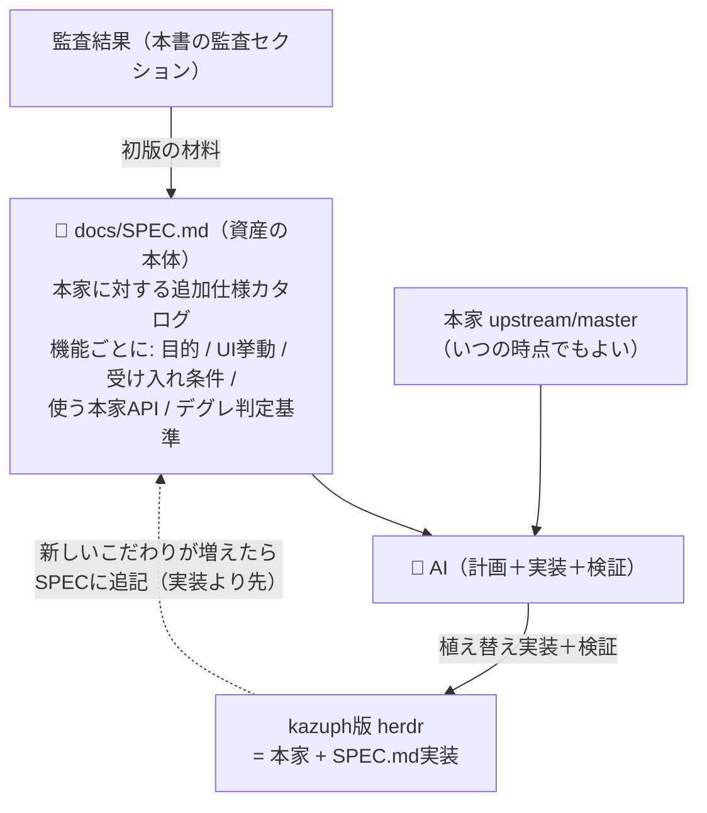
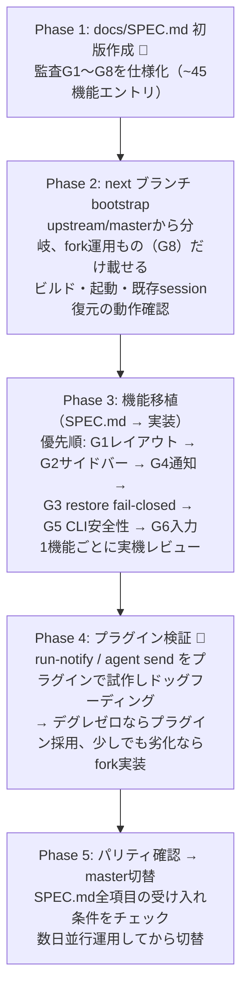
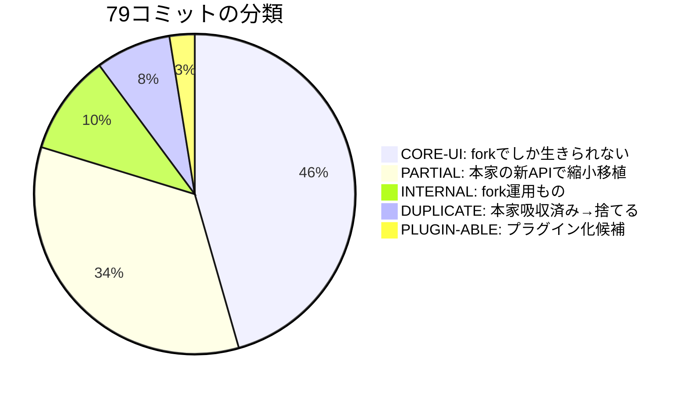
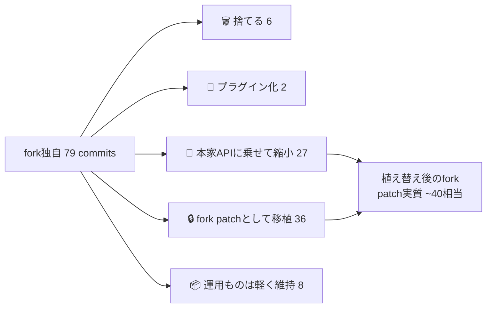
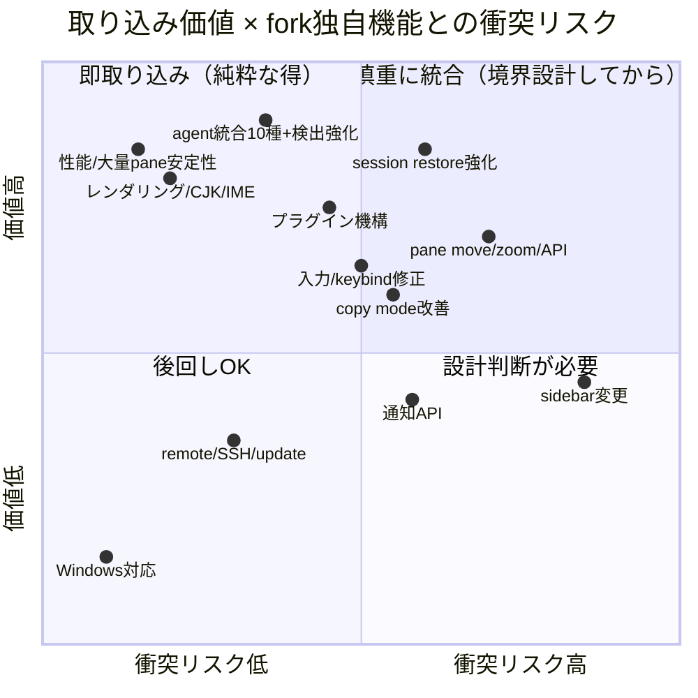
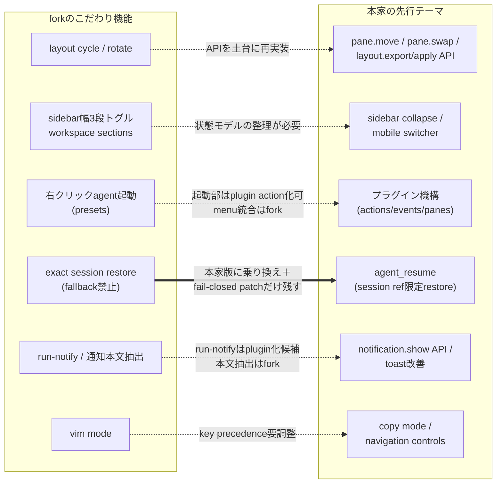

# herdr fork 運用戦略（fork-strategy）

このドキュメントは kazuph/herdr fork の公式運用戦略。本家 [ogulcancelik/herdr](https://github.com/ogulcancelik/herdr) との関係、fork独自機能の維持方針、植え替え（re-plant）計画を1本にまとめたもの。AI はこのドキュメントと `docs/SPEC.md`（Phase 1 で作成）を読めば、いつでも最新の本家から kazuph 好みの herdr を再構築できる状態を目指す。

## 決定事項（2026-07-02 レビューで確定）

1. **本家への完全移行はしない**。fork継続が正
2. **植え替え戦略を採用**：最新の upstream/master を土台に、fork独自機能を機能単位で植え付ける
3. **SPEC.md 駆動**：資産の本体は git 履歴ではなく仕様書。本家スペックへの「追記分」を `docs/SPEC.md` に常時メンテナンスする
4. **プラグイン機構は使える部分だけ使う**。ただし現在の使い心地から少しでもデグレするなら fork 実装を選ぶ
5. **本家への Pull Request は計画に含めない**。下記「本家へのPR還元について」参照

## ⚠️ 本家へのPR還元について（参考情報・計画外）

fork機能の一部を本家へ還元することは「**やってもよい**」が、**実行はマスターの明示指示があった場合のみ**。

> **AI（Claude / Codex / その他エージェント）が自発的に本家 ogulcancelik/herdr へ PR を作成・送信することを禁止する。** 計画やタスクリストに「PR還元」を含めてはならない。このセクションは将来やりたくなった時のための参考記録である。

参考として、本家のマージ済み外部PR 48件を分析した傾向（2026-07-02時点）:

| 傾向 | 実例（PR番号・規模） | 洞察 |
|---|---|---|
| 大型機能でも通る | named sessions #57 (+1102)、pane history #248 (+1137)、Devin統合 #622 (+1056) | 規模は障壁ではない |
| UI変更は「configでopt-in」なら通る | sidebar min/max width設定 #135、sidebar collapse control #291、mobile幅閾値 #317、入力ソース切替(macOS, opt-in) #434、CJK IME opt-in #220 | default挙動を変えず `[ui]` 設定でopt-inが鉄板の作法 |
| agent CLI統合は歓迎 | Copilot #386、Kimi #463、Cursor #506、Qoder #309 | 統合系は即マージ傾向 |
| copy mode/入力の質改善 | copy mode修正×3 (#389/#410/#460)、double-click word copy #296 | 挙動修正系も通る |

いつか出すなら通りやすい候補: sidebar幅presets（`ui.sidebar_width_presets` 化）、vim mode（`ui.vim_mode` opt-in）、layout cycle / rotate（keybind＋API、default無効）、tmux split key defaults（小粒）。逆に workspace sections・通知本文抽出・pane action bar は本家の設計思想と衝突しうるため fork 専用のままとする。

## SPEC.md 駆動モデル（戦略の核心）

「forkのgit履歴」ではなく「**仕様書**」を資産の本体にする。コミットは本家の大改造で腐るが、仕様は腐らない。

**SPEC.md の構成**（機能1つ＝1エントリ、監査セクションの G1〜G8 が初版の骨格になる）:

| フィールド | 内容 | 例（rotate pane） |
|---|---|---|
| 目的 | なぜ欲しいか | splitレイアウトを保ったままpaneの中身だけ回したい |
| UI挙動 | 操作と見た目の仕様 | action bar / 右クリックmenu / キーから forward・reverse回転 |
| 受け入れ条件 | 何ができたら完成か | 回転後もpane ID・terminal対応が入れ替わらない |
| 実装方針 | 本家のどのAPIに乗るか | `pane.swap` を土台に、menu統合はfork patch |
| デグレ判定 | 現forkと比べて劣化とみなす条件 | 回転にワンアクション以上かかる、IDが振り直される 等 |

## 実行計画（現forkバイナリは完成まで使い続ける＝生産性低下ゼロ）

- 一発マージは実測で104ファイル衝突（うち `src/` 本体50超）のため不可能。機能単位の植え替えが唯一の現実解
- 各Phaseの成果物はレビュー承認を通してから次へ進む

---

# 監査：fork独自79コミットはどうなるか

fork独自の79コミット全件を upstream/master と突き合わせた監査結果（2026-07-02、Codex 8並列＋Claude検証）。

### 全体像：79コミットはどうなる？

凡例: 🔒 CORE-UI ／ 🔧 PARTIAL ／ 🗑️ DUPLICATE ／ 🔌 PLUGIN-ABLE ／ 📦 INTERNAL

---

### G1. レイアウト操作（cycle / rotate / 右クリック移動）— 8件

**マスターのこだわり本丸その1。本家に無し、プラグイン不可 → fork移植。** ただし本家の `pane.move` / `pane.swap` APIが土台に使えるので実装量は縮む。

| 分類 | commit | 内容 |
|---|---|---|
| 🔒 | b452173 | layout cycle 拡張（横一列/縦一列/左右メイン/上下メイン/グリッド） |
| 🔒 | 634fc6e | 右クリックしたpaneをroot splitへ移動＋menuからcycle |
| 🔒 | e778a18 | 右クリックmenuに縦割り/横割り/均等化 |
| 🔒 | 8cb716c | pane action bar（cycle/rotate/equalize/zoomをマウスで） |
| 🔒 | 4cbc5e9 | action barの配色調整 |
| 🔧 | 978e23c | rotate pane（本家 `pane.swap` で実装縮小可） |
| 🔧 | 447bfa5 | restore/rotation跨ぎのpane ID安定化（本家がID安定化を部分実装済み） |
| 🔧 | 9349d61 / 487bfea | zoom中menuにUnzoom表示・無効なmenu項目を隠す |

### G2. サイドバー & ワークスペースUI — 21件

**こだわり本丸その2（最大グループ）。ほぼ全部本家に無し → fork移植。** 幅3段トグル・workspace sections・diff stats・slim密度など。

| 分類 | commit | 内容 |
|---|---|---|
| 🔒 | c5b7668 / aff2011 | **サイドバー幅3段トグル（NARROW/NORMAL/WIDE）**＋ラベル |
| 🔒 | 6b5e3ac / a31d120 / 3a9a374 / 74d5512 | **workspace sections**（Favorite/Work/Personal、折りたたみ、drag&drop） |
| 🔒 | 053bd55 / d35f348 | workspaceカードに**diff stats（+123 -11）**表示＋配置 |
| 🔒 | 848a8eb / f0f4385 | 狭い幅でも名前・git情報を優先表示 |
| 🔧 | b1d8526 | slim密度＋Agentsソート（ソートは本家 `ui.agent_panel_sort` 吸収済み、slim密度はfork） |
| 🔒 | 6c0cf33 / 78c0f64 | agent行にpane target（%23）表示 |
| 🔒 | 5b13801 / e3acfae | activeカード再タップでmenu・状態dot間隔 |
| 🔒 | 8a51ff9 | 最大幅72col＋section境界を越えないdrop |
| 🔒 | d5a853a | サイドバー空白右クリックmenu（stop/restart等） |
| 🔒 | 17ad5aa | 危険操作（Stop/Restart/Restore）の確認ダイアログ |
| 🔒 | 2fe5eb5 | workspace複製 |
| 🔧 | 845a538 | sections/幅トグル等の大型UX commit（本家吸収済み部分を含む） |
| 🔧 | 5699ca3 | worktreeのworkspace名改善（本家に部分実装あり） |
| 🔧 | a1dedf2 | 「Copied N lines」表示（本家は行数なしの汎用toastのみ） |

### G3. Agent復元（exact session restore）— 13件

**本家が一番追いついた領域。** native restore基盤・restore時のshell経由化は本家版に乗り換え、**「fallback全面禁止のfail-closed」だけforkの上乗せpatchとして残す**。

| 分類 | commit | 内容 |
|---|---|---|
| 🗑️ | d4c94b0 | agent_restore基盤 → 本家 `agent_resume`（db67e9d）が同等以上 |
| 🗑️ | ec2ceb0 | restore submit遅延 → 本家はshell経由起動（36a4608）で問題自体が消滅 |
| 🗑️ | 2938c43 | Codex stale working → 本家CHANGELOG #352で解決済み |
| 🔧 | 7cf02fa / 573f85e / 6ee56ec | pane毎のexact session id記録（plain process recovery部分はfork独自で残す） |
| 🔧 | 4e764ca / 8d43e8c | `--last`等のfallback拒否・fail-closed（本家も同方向だがforkの方が厳格） |
| 🔧 | 7a982bb | restorable agent paneの保持 |
| 🔒 | 9322429 / bcdaa3e / 007d0c7 | pane cleanup guard・restore状態toast・Claude化石spinner失効 |
| 📦 | 0c8f7f0 | restoreライフサイクルの回帰テスト |

### G4. 通知 — 7件

本家は `notification.show` API等の基盤を持つが、**「通知本文に最新のagent応答を抜き出す」「rate limit」「クリックでpaneへ飛ぶ」はfork独自**。

| 分類 | commit | 内容 |
|---|---|---|
| 🔌 | 2650c3b | **`run-notify`**（job log＋exit通知）→ 本家 `pane run`＋`notification.show` でプラグイン化候補 |
| 🔒 | 72ad4ad / 6f638ec / ef2a4ba | 通知本文＝最新応答抽出（罫線・status chrome除去）＋ラベル改善 |
| 🔧 | 515f5a7 | 通知rate limit（本家は遅延通知のみ） |
| 🔧 | b64fb1b | 通知クリックでpaneフォーカス＋agy検出（agy検出は本家吸収済み） |
| 🔒 | 4fd07f9 | render drain通知の正確化 |

### G5. Agent起動 & pane識別（CLI/API安全性）— 14件

herdrスキル群（tmux-pane-commander / bucho）の足場。**fail-closedなpane解決はforkの方が厳格**。

| 分類 | commit | 内容 |
|---|---|---|
| 🔧 | 95b812a | **右クリックからagent preset起動**＋方向pane移動（menu統合はfork、移動APIは本家吸収済み） |
| 🔒 | 80da299 / 047c240 | pane title常時表示＋gitブランチ表示 |
| 🔧 | 54e57e0 | agent titleとOSC titleの分離（本家 `pane.report_metadata` で縮小可） |
| 🔧 | 32d7de2 / b8aa2b7 | fail-closedなcurrent pane解決（本家はfocusへのfallbackが残る） |
| 🔧 | a5f2d9d / 130f5d7 / 87d2c49 | short pane target API・protocol表示・AI-readable help |
| 🔌 | f87cc86 | `agent send` のEnter確実送信（プラグイン/ラッパー化候補） |
| 🔒 | ab4a7c8 / 60036e2 | nested guard修正・headless入力await |

### G6. 入力・コピー・vim — 7件

copy mode本体は本家に完全吸収。**vim modeナビゲーションはfork独自**。

| 分類 | commit | 内容 |
|---|---|---|
| 🗑️ | e5e0e0e | copy mode本体 → 本家7626a9aが同等＋改善多数 |
| 🔒 | da3e541 | **vim mode**（Normal/Insert、h/j/k/lでpane移動） |
| 🔒 | c3d0853 | `prefix+]` でもcopy mode |
| 🔧 | bbf6c05 | tmux風 `prefix+%` / `prefix+"` split（本家parserは対応済み、default変更のみ残る） |
| 🔧 | 2ae1078 / 480a8f6 | Copilot CLI raw LF・Ghostty統合（本家に大部分あり） |
| 🔧 | f4ac406 | pane色保持（本家吸収済み、NO_COLOR除去のみfork） |

### G7. worktree操作 — 2件

| 分類 | commit | 内容 |
|---|---|---|
| 🗑️ | 92edda7 / e7338e4 | worktree作成/open/remove → 本家0148c13が同等以上（CLI/API付き）に完全吸収 |

### G8. fork運用（docs/build/テスト）— 7件

📦 fd1e1ac / 659637e / de0d64a / 73e429c / b2ea0fe / 6f62ce7 / f99d42f。機能ではなくfork運用（テスト匿名化・fork向けREADME・署名更新など）。植え替え後も軽量に維持。

---

### 結論

- **捨てられるのは6件だけ**（copy mode・agent restore基盤・worktree×2・Codex stale・submit遅延）
- こだわり本丸の **G1レイアウト操作＋G2サイドバーUI（計29件）はほぼ全部fork必須**
- G3〜G5は本家の新基盤（`agent_resume` / `pane.report_metadata` / `pane.swap`）に乗せると**patchが大幅に縮む**

📋 全79件の生テーブル（sha / 価値 / 分類 / 本家側の根拠 / conflict risk）— クリックで展開

Codex 8並列監査の原本要約。引用されている本家コミットSHA・CHANGELOG行はClaudeが実在検証済み。

#### chunk aa（最新10件）

| sha | title | 分類 | 本家側の根拠（要約） |
|---|---|---|---|
| 7cf02fa | fix: recover plain agent sessions exactly | 🔧 | 本家 `agent_resume` は公式報告のsession refのみ。plain session file recoveryは無し |
| 9322429 | fix: close inactive shell panes on exit | 🔒 | forkのrestorable pane方針前提のcleanup。plugin不可 |
| fd1e1ac | test: remove local fixture details | 📦 | forkテストの匿名化のみ |
| 0c8f7f0 | test: cover exact pane agent restore lifecycle | 📦 | forkテスト。本家は `agent_resume` 系へ置換済み |
| 573f85e | fix: persist exact agent sessions per pane | 🔧 | 本家に `persisted_agent_session` あり。pane ledgerとplain recoveryは無し |
| c3d0853 | fix: accept right bracket for copy mode | 🔒 | 本家defaultは `prefix+[` のみ |
| 7a982bb | fix: preserve restorable agent panes | 🔧 | 本家は「終了時shellへfallback」(CHANGELOG:195)で方針差 |
| aff2011 | fix: pad sidebar width labels | 🔒 | `SidebarWidthPreset` 相当なし |
| 4e764ca | fix: reject last-session restore fallbacks | 🔧 | 本家 `valid_session_id` はcontrol char拒否のみ。forkの方が厳格 |
| 2938c43 | fix: expire stale codex working status | 🗑️ | CHANGELOG:174 (#352)＋manifest detectionで解決済み |

#### chunk ab

| sha | title | 分類 | 本家側の根拠（要約） |
|---|---|---|---|
| 8d43e8c | fix: guard agent restore identity | 🔧 | 92a10fcでsession ref限定済み。restart danger dialogの欠落列挙は無し |
| 54e57e0 | fix: polish agent titles and footer labels | 🔧 | `pane.report_metadata` (CHANGELOG:216)で縮小可 |
| 6ee56ec | feat: preserve agent pane identity | 🔧 | `pane.report_agent(_session)` あり。cmdline観測経路は無し |
| 87d2c49 | feat: make root help AI-readable | 🔧 | 本家はSKILL.md案内のみ |
| 659637e | docs: clarify pane current process resolution | 📦 | docs-only |
| 845a538 | feat: sync upstream fixes and polish sidebar ux | 🔧 | 一部本家吸収済み（89ca3ba, d35c642等）。WorkspaceSection/幅トグルは無し |
| f4ac406 | fix: preserve pane colors | 🔧 | OSC color owner復元あり。NO_COLOR除去は無し |
| 4cbc5e9 | fix: tone down pane action bar colors | 🔒 | action bar自体がfork-only |
| 447bfa5 | fix: keep pane targets stable across restore and rotation | 🔧 | 226e873でrestore identityは部分吸収。rotationはfork-only |
| 95b812a | feat: add agent presets and directional pane moves | 🔧 | d35c642 (pane.move)で移動は縮小可。AgentPreset/menu起動は無し |

#### chunk ac

| sha | title | 分類 | 本家側の根拠（要約） |
|---|---|---|---|
| e5e0e0e | feat: add pane copy mode | 🗑️ | 本家7626a9a＋CHANGELOG:184 |
| 130f5d7 | fix: bump protocol for pane current api | 🔧 | 本家はprotocol 14 bump＋compatibility表示 |
| da3e541 | feat: add vim mode terminal navigation | 🔒 | no equivalent found（pane navigation controlsは別物） |
| 2650c3b | feat: add pane run notifications | 🔌 | `notification.show`＋`pane run`で再実装可 |
| b8aa2b7 | fix: resolve current pane from process session | 🔧 | c71c6c1はcaller pane使用だがfocused fallbackが残る |
| 8cb716c | feat: add pane action bar controls | 🔒 | no equivalent found。plugin v1で表現不可 |
| 978e23c | feat: rotate pane contents | 🔧 | `pane.swap` で実装縮小可。rotateは無し |
| bcdaa3e | fix: clarify empty agent restore status | 🔒 | no equivalent found |
| ec2ceb0 | fix: delay agent restore submit | 🗑️ | 36a4608のshell経由resumeで問題自体が消滅 |
| 17ad5aa | feat: confirm dangerous sidebar actions | 🔒 | `ConfirmDanger` 相当なし |

#### chunk ad

| sha | title | 分類 | 本家側の根拠（要約） |
|---|---|---|---|
| b452173 | feat: expand pane layout cycle | 🔒 | `cycle_layout` 該当なし |
| 9349d61 | fix: show unzoom in pane context menu | 🔧 | APIは `PaneZoomCommand::Off` あり。menu表示は固定 `Zoom` |
| 634fc6e | fix: move clicked pane and cycle layouts | 🔒 | `move_focused_to_root_split` 該当なし |
| 047c240 | fix: show pane git branch in title | 🔒 | workspace側branch cacheのみ |
| f87cc86 | fix: submit agent messages reliably | 🔌 | 本家はliteral textのみ。socketのsend_text＋send_keysで代替可 |
| 007d0c7 | fix: expire fossilized Claude spinner evidence | 🔒 | `activity_fingerprint` 相当なし |
| d4c94b0 | feat: add agent_restore | 🗑️ | db67e9d＋`agent_resume` が同等以上（対応agentも多い） |
| 515f5a7 | fix: rate limit agent notifications | 🔧 | 本家はdelay_secondsのみ。cooldown/shieldは無し |
| 72ad4ad | fix: extract agent responses for notification bodies | 🔒 | no equivalent found |
| 848a8eb | fix: keep workspace names visible in narrow sidebar rows | 🔒 | no equivalent found |

#### chunk ae

| sha | title | 分類 | 本家側の根拠（要約） |
|---|---|---|---|
| 5699ca3 | fix: improve workspace names for git worktrees | 🔧 | `GitSpaceMetadata.label` に部分実装 |
| 6f638ec | fix: ignore Codex status chrome in notifications | 🔒 | no equivalent found |
| 8a51ff9 | fix: improve sidebar sizing and section drops | 🔒 | 本家default 36のまま。WorkspaceSection無し |
| ef2a4ba | fix: refine agent notification labels | 🔒 | 本家は `agent_label event_text` 形式のみ |
| c5b7668 | feat: add sidebar width presets to global menu | 🔒 | global menuに該当項目なし |
| 74d5512 | fix: improve workspace sidebar identity and section drops | 🔒 | PaneTitleChanged→workspace名反映は無し |
| de0d64a | feat: remove agent hook integrations | 📦 | fork方針のhousekeeping（本家は逆にintegrations拡充） |
| 73e429c | docs: remove fork update flows | 📦 | fork運用 |
| b2ea0fe | docs: install from fork in readme | 📦 | fork運用 |
| 487bfea | fix: hide unavailable pane layout actions | 🔧 | 本家はAPI側noop reasonのみ。menuは残る |

#### chunk af

| sha | title | 分類 | 本家側の根拠（要約） |
|---|---|---|---|
| e778a18 | feat: add pane layout menu actions | 🔒 | `arrange_all`/`Equalize` 該当なし |
| 6f62ce7 | fix: refresh macos ad-hoc code signatures | 📦 | forkのbuild housekeeping |
| d5a853a | feat: add spaces sidebar blank menu | 🔒 | `sidebar blank` 該当なし |
| 80da299 | feat: always show pane titles | 🔒 | 本家はopt-inのagent labelのみ |
| a31d120 | feat: drag workspaces between sections | 🔒 | WorkspaceSection無し |
| 32d7de2 | feat: add safe current pane lookup | 🔧 | `pane current` あり。focused fallbackが残る |
| a1dedf2 | feat: show selection copy status | 🔧 | 本家は固定文言toastのみ |
| 3a9a374 | fix: polish workspace section interactions | 🔒 | WorkspaceSection無し |
| 6b5e3ac | feat: add collapsible workspace sections | 🔒 | 同等機能なし |
| 2fe5eb5 | feat: duplicate workspaces from context menu | 🔒 | `duplicate_workspace` 該当なし |

#### chunk ag

| sha | title | 分類 | 本家側の根拠（要約） |
|---|---|---|---|
| d35f348 | fix: move workspace branch labels after git stats | 🔒 | diff stats自体が本家に無し |
| 5b13801 | fix: open workspace menu on active card tap | 🔒 | no equivalent found |
| e7338e4 | fix: run worktree actions from mouse context menu | 🗑️ | 0148c13にmouse handler＋testsあり |
| 92edda7 | feat: add git worktree workspace actions | 🗑️ | 0148c13が同等以上（CLI/API付き） |
| 053bd55 | fix: show workspace diff stats | 🔒 | `WorkspaceGitStatus` にdiff stats無し |
| e3acfae | fix: space workspace indicator labels | 🔒 | 本家は番号自体を表示しない |
| 78c0f64 | fix: simplify agent sidebar pane ids | 🔒 | pane targetのsidebar表示自体が無い |
| b64fb1b | fix: focus notification panes and detect agy | 🔧 | Antigravity検出＋`pane.focus` は吸収済み。通知クリック遷移は無し |
| bbf6c05 | feat: add tmux split key defaults | 🔧 | parserは対応済み。defaultは未変更 |
| 6c0cf33 | fix: show pane targets in sidebar | 🔒 | no equivalent found |

#### chunk ah

| sha | title | 分類 | 本家側の根拠（要約） |
|---|---|---|---|
| a5f2d9d | fix: expose short pane targets in api | 🔧 | f7a7da0は `w1:p1` 系idを導入。forkのフィールドは無し |
| f0f4385 | fix: keep git details in slim sidebar rows | 🔒 | slim density自体が無し |
| b1d8526 | feat: add slim sidebar density and sorted agents view | 🔧 | ソートは5449025で吸収済み。slimは無し |
| 4fd07f9 | fix: avoid early render drain notifications | 🔒 | 本家はwrite前に送信のまま |
| ab4a7c8 | fix: ignore leaked herdr env for nested guard | 🔒 | parent process check無し |
| f99d42f | docs: require replacing local herdr after changes | 📦 | fork運用文書 |
| 2ae1078 | fix: preserve raw line feeds for copilot cli | 🔧 | 本家はShift+Enter preserve等でpartial |
| 480a8f6 | fix: improve copilot ghostty integration | 🔧 | Copilot integration/manifestあり。fork固有判定が残る |
| 60036e2 | fix: await headless terminal input forwarding | 🔒 | 本家はsync `try_send_bytes` のまま |

---

# 本家449コミットを取り込むと何が得られるか

対象: `master..upstream/master` の 449 commits と本家CHANGELOG。件数はキーワード分類による粗い重複カウント。

### 図解サマリ：何がどれだけ得られる？

**本家449コミットのテーマ別規模**（重複カウントあり・█≒8commits）

| テーマ | commits | 規模 |
|---|---:|---|
| agent統合/検出強化 | 103 | █████████████ |
| pane layout/move/zoom | 55 | ███████ |
| 入力/keybind/IME | 45 | ██████ |
| session restore強化 | 37 | █████ |
| API/socket/worktree | 34 | ████ |
| Windows対応 | 31 | ████ |
| レンダリング/CJK | 24 | ███ |
| remote/SSH/update | 16 | ██ |
| **プラグイン機構** | 14 | ██ |
| 性能/安定性 | 13 | ██ |
| copy mode | 12 | ██ |
| sidebar | 9 | █ |
| 通知 | 5 | █ |

#### マスター（macOS・Claude/Codexヘビー・UI重カスタム）にとっての価値マップ

#### fork独自機能と本家テーマの重なり

**読み方**: 実線（F4→U4）は「本家版へ乗り換えて差分だけ残す」、点線は「本家の基盤を使ってfork機能を作り直す」。

### 概要

upstream 吸収で一番大きい gain は、Claude/Codex だけでなく OpenCode、OMP、Pi、Devin、Kimi、Droid、Kilo、Cursor Agent、GitHub Copilot CLI、Qoder まで含む agent lifecycle / session restore 基盤の拡張です。macOS で Claude/Codex pane を大量に並べ、sidebar と pane 操作を深くカスタムしている power user にとっては、agent 状態の誤検出減少、復元の堅牢化、copy/input の細かい修正が実利です。

一方で、Windows beta、website/release docs、CI、contributor workflow は commit 数こそ多いものの、macOS fork 利用者の即効性は低めです。plugin system と socket/API 拡張は将来の自動化・右クリック起動・preset 化に効くので、fork 側の独自 UX と衝突しない形で吸収する価値が高いです。

### 1. Agent lifecycle / 新 agent 統合

粗い件数: 約103 commits。  
Claude/Codex/OpenCode/OMP/Pi の既存系に加えて、Devin、Kimi Code、Droid、Kilo Code、Cursor Agent、GitHub Copilot CLI、Qoder、Antigravity などの検出・hook・session identity が増えています。画面ヒューリスティックだけに頼らず、hook や manifest から lifecycle と session id を拾う方向に寄っており、blocked/working/done の誤判定や stale state がかなり減ります。

macOS で Claude/Codex を重く使う人には、他 agent を使わなくても Codex の interrupt/status header、Claude の question prompt、OpenCode/OMP の release/restart 周りの修正が効きます。fork overlap: **agent presets**, **right-click agent launch**, **exact session restore**, **run notifications** と強く重なります。preset や右クリック起動は upstream plugin/API/agent identity と結合しやすく、既存 fork 実装の命名・session id 所有権ルールとの衝突確認が必要です。

### 2. Exact session restore / pane history / session navigator

粗い件数: 約37 commits。  
`restore agent sessions`、`persist pane history across restarts`、`session navigator`、`agent session refs in api`、root agent の session 保護、nested child report の無視、background pane restore など、restore 系が大きく進んでいます。特に「pane の exact session id だけで復元する」運用では、child process や nested agent に session id を上書きされない修正が重要です。

heavy pane 運用では、Herdr 再起動や update 後に pane/agent が残ること自体が価値です。fork overlap: **exact session restore** と完全に重なります。fork 側で「last fallback 禁止」「pane ごとの観測済み session id のみ復元」という強い方針を持っている場合、upstream の restore 便利機能を入れる際も fallback 的な挙動を復活させない監査が必要です。

### 3. Plugin system / marketplace / plugin API

粗い件数: 約14 commits。  
local plugin v1、plugin install/list/unlink/enable/disable、manifest-declared actions、event hooks、managed plugin panes、plugin link handlers、marketplace/blacklist、config dir、min Herdr version などが追加されています。plugin host API として `pane.current`、`pane.process_info`、`layout.export/apply`、placement、window title、plugin pane ownership も整っています。

power user にとっては、agent 起動 preset、pane 配置、通知、link handler、独自 sidebar 行動を外部化できる足場です。fork overlap: **right-click agent launch**, **agent presets**, **pane layout cycle**, **sidebar width presets**, **run notifications** と広く重なります。fork の独自 UI を upstream plugin action に寄せられるなら保守コストが下がりますが、plugin lifecycle が pane ownership を持つため、既存の右クリック起動や preset 保存形式とは merge 時に境界整理が必要です。

### 4. Pane layout / move / zoom / navigation

粗い件数: 約55 commits。  
`pane.move` API/CLI、pane zoom、pane navigation controls、directional swap、resize shrink 修正、configurable pane gaps、border/intersection 色修正、focused border marker 削除、pane id 安定化などが入っています。layout/export/apply も plugin host API と絡み、pane を restart せずに tab/workspace 間移動できる方向に伸びています。

macOS で pane/sidebar を強くカスタムしている人には、pane 移動・zoom・navigation API が scripting と UI 操作の両方に効きます。fork overlap: **pane layout cycle**, **pane rotation**, **vim navigation** と強く重なります。upstream の `pane.move` / directional swap と fork の rotation/cycle が同じ keybind・同じ geometry mutation 経路に触る可能性が高いので、吸収時は操作体系を一本化したほうがよいです。

### 5. Sidebar / mobile switcher / workspace visibility

粗い件数: 約9 commits。  
hidden collapsed sidebar mode、expanded sidebar collapse control、agent panel priority sort、worktrees tree in mobile switcher、agents-first mobile switcher、live workspace labels in navigator/notifications などが増えています。sidebar は workspace 一覧だけでなく、agent 優先の監視面として整理される方向です。

power user には、複数 workspace/tabs/panes に散った agent を探す時間が減るのが実利です。fork overlap: **sidebar width presets**, **agent presets**, **run notifications** と重なります。sidebar width preset は upstream には直接見えませんが、collapsed/hidden/expanded と mobile switcher の状態が増えているため、fork 側 preset が保持すべき state の範囲を見直す必要があります。

### 6. Copy mode / clipboard / selection

粗い件数: 約12 commits。  
pane copy mode 本体、linewise selection 維持、copy mode exit 時の scroll 位置復元、page scrolling boundary、ctrl page navigation、double-click word copy、clipboard feedback、OSC52/Wsl/native clipboard、image clipboard validation などが入っています。copy mode は単なる表示機能ではなく、long-running agent transcript を読む・抜き出すための操作面として成熟しています。

Claude/Codex の長い出力を pane 内で読む人にはかなり実用的です。fork overlap: **copy mode**, **vim navigation** と強く重なります。fork の vim navigation が copy mode cursor/selection と同じ keymap 層に触っている場合、`ctrl` page navigation や linewise selection と衝突しやすいので、吸収時に mode ごとの key precedence を確認する必要があります。

### 7. Input / keybind / mouse / IME

粗い件数: 約45 commits。  
user keybindings が default を正しく置換する修正、key-combo syntax for API send keys、kitty keypad、F1-F4 alternate sequence、legacy shifted letters、unicode keybindings、application keypad、ctrl slash、mouse any-motion、right-click passthrough、macOS cmd/ctrl-click link handling、CJK IME opt-in などが入っています。pane app に入力を「余計に変換せず正しく届ける」修正が多いです。

macOS で Vim/Neovim、Claude/Codex、mouse-enabled TUI を Herdr 内で使う人には、細かいストレスが減ります。fork overlap: **vim navigation**, **right-click agent launch**, **copy mode** と重なります。特に right-click は upstream が passthrough modifier と context menu を扱うため、fork の右クリック agent launch と優先順位・modifier 設計を明示しないと UX が割れます。

### 8. Notifications / toast / run completion

粗い件数: 約5 commits。  
toast ergonomics、notification.show API/CLI、sound の none/done/request、toasts retained render preservation、notifications below floating overlays、live workspace labels in notifications が入っています。通知は単発 chime から、外部 automation が出せる UI event に近づいています。

heavy agent runner には、background pane の完了・blocked を見逃しにくくなるのが実利です。fork overlap: **run notifications** と完全に重なります。fork 側の run-notify/herdr pane 報告と upstream notification API が二重通知にならないよう、どちらを user-facing alert にするか整理が必要です。

### 9. Performance / large session stability

粗い件数: 約13 commits。  
idle pty actor poll 削減、sidebar git polling overhead 削減、headless server scroll CPU 削減、terminal render retain、idle agent checker CPU 削減、event queue stall 回避、client writer blocking 回避などが入っています。大量 pane と長時間 session で、UI lag や CPU 常時消費を減らす方向です。

macOS で Claude/Codex pane を多数開きっぱなしにする人には、直接効く可能性が高いです。fork overlap は明示機能名とは薄いですが、**sidebar width presets** や **run notifications** のような常時表示/常時監視 UI の体感品質に影響します。performance 修正は fork 独自 UX より基盤側なので、競合が少なければ優先吸収候補です。

### 10. Windows support

粗い件数: 約31 commits。  
native Windows beta、preview installer、ConPTY、PowerShell pane survival、Windows Terminal multiline paste、win32 bracketed paste、Windows hooks/input paths、installer checksum、Windows updater channel、cursor rendering、path/worktree handling などがまとまっています。platform 対応としては大きいですが、macOS 専用運用では直接 gain は限定的です。

ただし、input/paste/terminal abstraction の修正が Windows 経由で共通化されているものは macOS にも間接効果があります。fork overlap は基本的に低いですが、**copy mode**, **vim navigation**, **exact session restore** に関わる共通 terminal/input 経路は確認対象です。Windows 固有 commit は価値が低いというより、macOS power user の優先度が低いテーマです。

### 11. Remote / SSH / update / package-managed installs

粗い件数: 約16 commits。  
remote SSH keepalive fallback、remote sessions alive across disconnects、remote handshake timeout、package-managed remote installs、remote image paste scope、fish remote bootstrap、package-manager remote updates、preview update channel、background update toggles などが入っています。remote Herdr と update flow が壊れにくくなっています。

macOS local-only なら優先度は中程度ですが、remote attach や SSH 越し agent を使うなら価値があります。fork overlap: **exact session restore** と **run notifications** に間接的に重なります。disconnect 後も session を保つ修正は便利ですが、fork の「実際に pane に紐づいた session id だけを信じる」方針と矛盾しないか確認が必要です。

### 12. Socket/API/schema/worktree automation

粗い件数: API 約18 commits、worktree/git 約16 commits。  
socket protocol schema 生成、API schema CLI 露出、session snapshot API、terminal session observe/control streams、pane send key-combo、worktree CLI/socket API、worktree create existing branch checkout、worktree operations deferred to runtime、bare repo support などが増えています。automation surface が増え、外部 agent や plugin が Herdr をより直接操作できます。

power user には、Herdr を pane manager ではなく agent orchestration substrate として使いやすくなる gain です。fork overlap: **right-click agent launch**, **agent presets**, **pane layout cycle**, **run notifications**, **exact session restore** と広く重なります。fork 独自機能を CLI/API 化しているなら、upstream schema と public id の安定化に合わせる価値があります。

### 13. Terminal rendering / Unicode / colors / themes

粗い件数: 約24 commits。  
ANSI undercurl、CJK pane border labels、wide-character spacer cell skip、grapheme clusters、OSC 4/10/11/12 color replies、theme auto-switch、host color reply leakage 防止、kitty file media、cursor rendering などが入っています。CJK、emoji、theme-aware TUI、OpenCode などが Herdr pane 内で壊れにくくなります。

日本語・CJK branch 名・CJK IME・agent TUI を使う macOS power user には地味に重要です。fork overlap は機能名としては薄いですが、**copy mode** と **vim navigation** の見た目・カーソル・選択精度に関係します。pane rendering の基盤修正なので、独自 UI より先に取り込む価値が高いです。

### 14. Bug fixes / release/docs/CI hygiene

粗い件数: 全体の残り多数。  
CHANGELOG/website/preview manifest/release workflow/CI/contributor approval/docs 整備が多く、ユーザー機能ではない commit も相当あります。release note や docs は upstream の機能理解には役立ちますが、fork がそのまま吸収しても macOS runtime 価値は限定的です。

ただし release docs には新機能の意図と user-facing 仕様がまとまっているため、merge conflict 解消や fork の docs 更新時には参照価値があります。fork overlap は低いですが、plugin trust/security guidance と agent instruction scope は **agent presets** や plugin を使った起動 UI の安全設計に関係します。

### Fork 機能との重なり一覧

- **pane layout cycle**: `pane.move`、layout export/apply、pane navigation、directional swap、zoom、pane gaps と重なる。吸収時は geometry mutation 経路と keybind 優先順位を統一する。
- **pane rotation**: directional swap / pane move と概念が近い。restart なし pane 移動を upstream が持つため、fork rotation を別実装で残すと挙動差が出る。
- **sidebar width presets**: upstream は hidden/collapsed/expanded/sidebar sections/mobile switcher を増やしている。preset がどの sidebar state を保存するか再定義が必要。
- **right-click agent launch**: upstream は right-click passthrough、pane context menu、ctrl/cmd-click link handler、plugin link/action を持つ。右クリックの通常メニュー、pane app passthrough、agent launch の優先順位を決める必要がある。
- **agent presets**: plugin system、custom command descriptions、agent manifest/hook integrations と強く重なる。preset を plugin action 化できる可能性がある。
- **exact session restore**: upstream の restore 強化と完全に重なる。child/nested report 無視は gain だが、`--last` 的 fallback が混ざらないか監査が必要。
- **run notifications**: notification.show、toast ergonomics、live labels、preserved toasts と重なる。二重通知を避ける設計が必要。
- **copy mode**: upstream が本体と複数の cursor/scroll/selection 修正を持つ。fork copy mode があるなら upstream に寄せる価値が高い。
- **vim navigation**: pane navigation controls、navigate movement keybind config、copy mode ctrl page navigation、legacy shifted bindings、key-combo API と重なる。mode ごとの key precedence を確認する。

### 吸収優先度

1. 高: agent lifecycle/session restore、copy mode、terminal rendering、performance、input/keybind 修正。macOS Claude/Codex heavy use に直接効く。
2. 中: plugin system/API/worktree/pane move/sidebar。fork 独自 UX と重なるので、吸収前に機能境界を決めると大きな土台になる。
3. 低: Windows 固有、release/docs/CI/website。macOS power user の即効性は薄いが、共通 input/terminal 修正を含むものだけは見落とさない。
